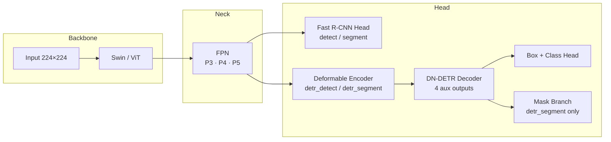
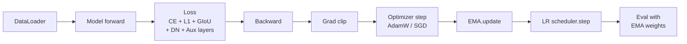

# Vision Transformer + Swin Transformer — Classify · Detect · Segment

<p align="center">
  
  
  
  
  
</p>

<p align="center">
  <b>ViT / Swin Transfer Learning for Classification, Detection, and Segmentation</b>
</p>

<p align="center">
  Clean training workflow &nbsp;•&nbsp; Built-in COCO metrics &nbsp;•&nbsp; DN-DETR end-to-end detection &nbsp;•&nbsp; Plug-in Attention Modules &nbsp;•&nbsp; Checkpoint Resume
</p>

> **Notice:** This repository is for learning, research, and educational demonstration only. Commercial use is strictly prohibited.

---

## 🧭 Overview

This project unifies Vision Transformer (ViT) and Swin Transformer into **five** computer-vision tasks — image classification, R-CNN-style detection, R-CNN-style segmentation, and two DN-DETR variants — all under a single `train.py` / `predict.py` entry point.

### Two detection paradigms

```
R-CNN path:  Backbone (ViT / Swin) → FPN → Fast R-CNN head → [Mask R-CNN branch]
DETR path:   Swin → FPN (P3/P4/P5) → Deformable Encoder → DN-DETR Decoder → [Mask Branch]
```

Transfer learning is the default workflow everywhere: freeze the backbone, fine-tune the head.  
All outputs (metrics CSVs, plots, checkpoints) land consistently in `run/train/expN/`.

---

## ✨ Key Features

| Feature | Details |
|---------|---------|
| **Multiple backbones** | ViT (base/large/huge) and Swin (tiny/small/base) |
| **Five tasks, one entry point** | `classify` · `detect` · `segment` · `detr_detect` · `detr_segment` |
| **Deformable DETR Encoder** | `DeformableAttention` replaces encoder self-attention; no stacking conflict with SCSA |
| **DN-DETR denoising** | Noised GT queries during training accelerate convergence vs vanilla DETR |
| **Decoder auxiliary losses** | 4-layer decoder generates 4 independent predictions; each receives its own Hungarian match + loss |
| **EMA weights** | Shadow model updated every step; used for evaluation and saved in checkpoints |
| **LR warmup + cosine decay** | Linear ramp then cosine annealing; configurable via `--warmup-epochs` |
| **Differential LR** | Backbone trains at `lr × scale` (default 0.1×); head at full LR |
| **Weight decay exclusion** | Biases and 1-D norm params (LayerNorm/BN γ, β) get `weight_decay=0` automatically |
| **Plug-in attention modules** | 20 attention modules in `AttentionModules/` (SCSA, DANet, DeformableAttention, CBAM, SE, CA, …) |
| **Checkpoint resume** | Restores model, optimizer, scheduler, EMA in one `--resume` flag |
| **COCO mAP evaluation** | mAP@0.5 and mAP@0.5:0.95 via pycocotools |
| **ONNX export** | Task auto-detected; verified against PyTorch outputs |

---

## 🏗️ Architecture

### Overall flow



### DETR encoder design

The encoder uses `DeformableAttention` *as* the self-attention inside each layer — not stacked on top of a standard Transformer encoder. This eliminates the triple-attention conflict (SCSA → DeformableAttn → TransformerEncoder) that degraded convergence in earlier versions.

```
Each encoder layer:
  [level-i feature map]
       ↓
  DeformableAttention (learns sparse sampling offsets)
       ↓
  FFN (shared across levels)
       ↓
  LayerNorm + residual
```

### Training pipeline



### LR schedule

```
LR
 |        /‾‾‾‾‾‾‾‾‾‾‾‾‾‾‾‾‾‾‾‾‾‾‾\
 |       /                          \
 |      /    cosine decay            \
 |     /                              ‾‾‾‾‾‾‾
 |    /  warmup
 |   /
 |__/
 0       warmup_epochs                total_epochs
```

---

## 🧩 Attention Module Library (`AttentionModules/`)

A plug-in collection of 20 self-contained attention mechanisms. Import any module directly:

```python
from AttentionModules import SCSA, DANet, DeformableAttention, CBAM, SE  # etc.
```

### Integrated modules

These modules are wired into the training pipeline and activated automatically:

| Module | Mechanism | Where used |
|--------|-----------|-----------|
| **SCSA** | Two-stage block: multi-scale axis attention (SMSA) captures spatial direction cues via 1-D depthwise convs; pooled channel self-attention (PCSA) refines channel importance on a downsampled map | SwinFPN neck — applied after each FPN level (detect / segment tasks) |
| **DANet** | Dual parallel attention: Position Attention Module (PAM) captures long-range spatial dependencies via HW×HW affinity; Channel Attention Module (CAM) models inter-channel semantic correlation via C×C affinity; fused by element-wise sum | `detr_segment` mask branch — applied to FPN features before mask prediction |
| **DeformableAttention** | Sparse attention: each query attends to K learned sampling points whose positions are predicted dynamically from query content; O(N·K) vs O(N²) of standard attention | DETR encoder — replaces self-attention inside every encoder layer |
| **DETRAttention** | Standard multi-head attention with optional cross-attention; used for encoder self-attention (vanilla path) and decoder cross-attention between object queries and encoder memory | DETR decoder cross-attention layers |

### Available modules (plug-in ready)

These modules are implemented and importable but not yet wired into a default task path. Drop them into any feature map where `(B, C, H, W)` is the shape:

| Module | Type | Key idea |
|--------|------|----------|
| **ECA** | Channel | Lightweight 1-D conv on channel descriptors — no FC bottleneck |
| **EMA** | Channel + Spatial | Multi-scale grouped attention with cross-group aggregation |
| **SE** | Channel | Global avg pool → FC bottleneck → sigmoid channel gate |
| **CBAM** | Channel + Spatial | Sequential channel gate (avg+max pool) then spatial gate (conv) |
| **CA** | Coordinate | Decomposes 2-D pooling into H- and W-strip descriptors for location-preserving channel attention |
| **BAM** | Channel + Spatial | Parallel channel and spatial branches with dilation convs; fused by element-wise product |
| **ELA** | Spatial | Efficient local attention with grouped norm for high-resolution maps |
| **CCAM** | Channel | Cross-covariance attention; models cross-feature-map correlations |
| **SK** | Channel | Selective kernel: multi-branch conv with soft feature recalibration by channel attention |
| **SimAM** | Parameter-free | Energy-based 3-D attention without any extra parameters |
| **ACmix** | Hybrid | Self-attention and convolution share the same projection; output mixed by learnable weights |
| **GAM** | Channel + Spatial | MLP channel attention followed by multi-scale conv spatial attention |
| **SLAM** | Spatial | LSTM-based sequential spatial attention along row/column directions |
| **TripletAttention** | Spatial + Channel | Three-branch rotational attention across all axis combinations |
| **A2** | Spatial | Double attention: gathers then distributes features via two softmax steps |
| **SwinAttention** | Window self-attention | Swin-style shifted-window multi-head self-attention (standalone) |

---

## 🔥 Training Optimizations

Five best-practices are implemented and can all be controlled via CLI arguments:

### 1 · LR Warmup (`--warmup-epochs`, default 5)

Linearly ramps LR from 0 to `--lr` over the first N epochs, preventing instability from random-init heads in the early phase. After warmup, cosine annealing takes over.

### 2 · Decoder Auxiliary Losses

The 4-layer DETR decoder iterates layer-by-layer. Each intermediate layer generates its own `(pred_logits, pred_boxes)` pair, receives a full Hungarian match against GT, and contributes to the total loss:

```
loss_total += Σ (loss_ce_aux_i + loss_bbox_aux_i + loss_giou_aux_i)   i = 0,1,2
            + loss_ce + loss_bbox + loss_giou + loss_dn_*
```

This provides 4× denser gradient signal compared to supervising only the last layer.

### 3 · Differential LR (`--backbone-lr-scale`, default 0.1)

Pre-trained backbone parameters are updated at a lower rate than the randomly-initialised head:

```
head     parameters → lr  =  --lr
backbone parameters → lr  =  --lr × --backbone-lr-scale
```

### 4 · Weight Decay Exclusion

Bias terms and 1-D parameters (LayerNorm / BatchNorm γ, β) are automatically placed in a separate parameter group with `weight_decay = 0`. Only weight matrices and conv filters receive L2 regularisation — following standard Transformer training practice (GPT-2, ViT, etc.).

### 5 · EMA — Exponential Moving Average (`--ema-decay`, default 0.9999)

A shadow copy of the model is maintained:

```
shadow_w  =  d · shadow_w  +  (1 − d) · model_w
```

where `d = min(decay, (1 + n) / (10 + n))` warms up over the first few hundred steps to avoid early poor weights polluting the average. The EMA model is used for **all validation** and is saved in `best.pth` / `last.pth` under the key `ema_state`. Set `--ema-decay 0` to disable.

---

## 🗂️ Project Structure

```
vision_transformer/
├── train.py                      # Unified training entry (all 5 tasks)
├── predict.py                    # Inference for single image or directory
│
├── model/
│   ├── vit_model.py              # ViT backbone
│   ├── swin_model.py             # Swin backbone
│   ├── detection_head.py         # Fast R-CNN detection head
│   ├── segmentation_head.py      # Mask R-CNN segmentation head
│   ├── detr_head.py              # DN-DETR encoder-decoder (Deformable encoder)
│   ├── mask_branch.py            # Mask branch for DETR segmentation
│   └── swin_detr.py              # Swin + DN-DETR full model wiring
│
├── AttentionModules/             # 20 plug-in attention modules
│   ├── SCSA.py                   # Integrated: SwinFPN (detect/segment)
│   ├── DANet.py                  # Integrated: detr_segment
│   ├── DeformableAttention.py    # Integrated: DETR encoder
│   ├── CBAM.py, SE.py, CA.py … # Available for downstream use
│   └── __init__.py
│
├── tools/
│   ├── utils.py                  # Training helpers: ModelEMA, make_param_groups,
│   │                             #   make_cosine_lr, train_one_epoch, evaluate
│   ├── matcher.py                # Hungarian matcher (scipy linear_sum_assignment)
│   ├── detr_loss.py              # SetCriterion: CE + L1 + GIoU + DN + Aux
│   ├── my_dataset.py             # Classification dataset / dataloaders
│   ├── coco_dataset.py           # COCO dataset / dataloaders
│   ├── plot_metrics.py           # Loss/accuracy/PRF curves, confusion matrix
│   └── create_exp_folder.py      # Auto-increment run/train/expN folders
│
└── onnx_tools/
    ├── export_onnx.py            # Export checkpoint → ONNX
    └── verify_export_onnx.py     # Numerical verification vs PyTorch
```

---

## ⚙️ Installation

Python 3.10+ recommended.

```bash
pip install -r requirements.txt
```

Key dependencies: `torch`, `torchvision`, `tqdm`, `Pillow`, `numpy`, `pandas`, `matplotlib`, `opencv-python>=4.9`, `onnx`, `pycocotools`

---

## 🧪 Data Preparation

### Classification

ImageFolder layout — one subfolder per class:

```
Plant_Leaf_Disease/
├── Tomato_Healthy/
│   ├── img001.jpg
│   └── ...
├── Tomato_Early_Blight/
└── ...
```

### Detection / Segmentation (R-CNN and DETR)

COCO format:

```
data/my_dataset/
├── images/train/
├── images/val/
└── annotations/
    ├── instances_train.json
    └── instances_val.json
```

---

## 🚀 Training

> **Tip:** Start with `--epochs 1 --eval-interval 1` as a smoke test before full runs.

### 1) Classification

```bash
python train.py \
  --task classify \
  --data-path Plant_Leaf_Disease \
  --model vit_base_patch16_224_in21k \
  --weights weights/jx_vit_base_patch16_224_in21k-e5005f0a.pth \
  --epochs 100 \
  --batch-size 128 \
  --lr 0.001 \
  --lrf 0.01 \
  --warmup-epochs 5 \
  --freeze-layers True \
  --device cuda:0
```

### 2) Detection (R-CNN)

```bash
python train.py \
  --task detect \
  --train-img-dir data/TOMATO.v5i.coco-segmentation/images/train \
  --train-ann-file data/TOMATO.v5i.coco-segmentation/annotations/instances_train.json \
  --val-img-dir   data/TOMATO.v5i.coco-segmentation/images/val \
  --val-ann-file  data/TOMATO.v5i.coco-segmentation/annotations/instances_val.json \
  --model swin_small_patch4_window7_224 \
  --weights weights/swin_small_patch4_window7_224.pth \
  --epochs 100 \
  --eval-interval 1 \
  --batch-size 4 \
  --lr 1e-4 \
  --warmup-epochs 5 \
  --backbone-lr-scale 0.1 \
  --ema-decay 0.9999 \
  --device cuda:0
```

### 3) Segmentation (Mask R-CNN)

```bash
python train.py \
  --task segment \
  --train-img-dir data/TOMATO.v5i.coco-segmentation/images/train \
  --train-ann-file data/TOMATO.v5i.coco-segmentation/annotations/instances_train.json \
  --val-img-dir   data/TOMATO.v5i.coco-segmentation/images/val \
  --val-ann-file  data/TOMATO.v5i.coco-segmentation/annotations/instances_val.json \
  --model swin_small_patch4_window7_224 \
  --weights weights/swin_small_patch4_window7_224.pth \
  --epochs 100 \
  --eval-interval 1 \
  --batch-size 4 \
  --lr 1e-4 \
  --warmup-epochs 5 \
  --ema-decay 0.9999 \
  --device cuda:0
```

### 4) DN-DETR Detection

End-to-end detection — no anchors, no proposals.

```bash
python train.py \
  --task detr_detect \
  --train-img-dir data/TOMATO.v5i.coco-segmentation/images/train \
  --train-ann-file data/TOMATO.v5i.coco-segmentation/annotations/instances_train.json \
  --val-img-dir   data/TOMATO.v5i.coco-segmentation/images/val \
  --val-ann-file  data/TOMATO.v5i.coco-segmentation/annotations/instances_val.json \
  --model swin_tiny_patch4_window7_224 \
  --weights weights/swin_tiny_patch4_window7_224.pth \
  --epochs 150 \
  --eval-interval 5 \
  --batch-size 4 \
  --lr 1e-4 \
  --warmup-epochs 10 \
  --backbone-lr-scale 0.1 \
  --freeze-layers partial \
  --num-queries 100 \
  --ema-decay 0.9999 \
  --device cuda:0
```

### 5) DN-DETR Segmentation

Boxes **and** per-instance pixel masks, end-to-end.

```bash
python train.py \
  --task detr_segment \
  --train-img-dir data/TOMATO.v5i.coco-segmentation/images/train \
  --train-ann-file data/TOMATO.v5i.coco-segmentation/annotations/instances_train.json \
  --val-img-dir   data/TOMATO.v5i.coco-segmentation/images/val \
  --val-ann-file  data/TOMATO.v5i.coco-segmentation/annotations/instances_val.json \
  --model swin_tiny_patch4_window7_224 \
  --weights weights/swin_tiny_patch4_window7_224.pth \
  --epochs 200 \
  --eval-interval 5 \
  --batch-size 4 \
  --lr 1e-4 \
  --warmup-epochs 10 \
  --backbone-lr-scale 0.1 \
  --freeze-layers partial \
  --num-queries 100 \
  --ema-decay 0.9999 \
  --device cuda:0
```

### 6) Resume from Checkpoint

```bash
python train.py \
  --task detr_segment \
  --resume run/train/exp33/weights/last.pth \
  --epochs 200 \        # absolute total — NOT "200 more epochs"
  --train-img-dir ...   # same data args as original run
  --model swin_tiny_patch4_window7_224 \
  --device cuda:0
```

- Exp folder is **reused** automatically (inferred from checkpoint path)
- `metrics.csv` is **appended** — plots cover full history
- Model weights, optimizer, LR scheduler, EMA state, `best_metric` all restored
- Always use `last.pth` for resume (not `best.pth`)

---

## 📋 CLI Reference

### Training arguments

| Argument | Default | Applies to | Description |
|----------|---------|------------|-------------|
| `--task` | `segment` | all | `classify` / `detect` / `segment` / `detr_detect` / `detr_segment` |
| `--epochs` | `100` | all | Total training epochs |
| `--batch-size` | `4` | all | Batch size (reduce if OOM) |
| `--lr` | `0.001` | all | Base learning rate. Recommended: `1e-4` for AdamW tasks |
| `--lrf` | `0.1` | all | Final LR = `lr × lrf` (cosine end value) |
| `--warmup-epochs` | `5` | all | Linear LR warmup before cosine decay; `0` to disable |
| `--backbone-lr-scale` | `0.1` | all | Backbone LR = `lr × scale`; applies when backbone not fully frozen |
| `--ema-decay` | `0.9999` | all | EMA coefficient; `0` to disable |
| `--model` | `swin_base_…` | all | Backbone name (see backbone list) |
| `--weights` | — | all | Pre-trained backbone weights path |
| `--freeze-layers` | `none` | all | `all` / `partial` (DETR: keep stage2+3) / `none` |
| `--device` | `cuda:0` | all | Device string |
| `--eval-interval` | `1` | detect/segment/detr_* | Run evaluation every N epochs |
| `--resume` | — | detect/segment/detr_* | Checkpoint path to resume from |
| `--num-queries` | `100` | detr_* | Number of object queries |
| `--d-model` | `256` | detr_* | Transformer hidden dimension |
| `--num-enc-layers` | `4` | detr_* | Encoder depth |
| `--num-dec-layers` | `4` | detr_* | Decoder depth (each layer also produces auxiliary loss) |
| `--num-dn-groups` | `2` | detr_* | DN denoising groups |
| `--cost-class` | `1.0` | detr_* | Hungarian matching weight: classification |
| `--cost-bbox` | `5.0` | detr_* | Hungarian matching weight: L1 bbox |
| `--cost-giou` | `2.0` | detr_* | Hungarian matching weight: GIoU |

### Inference arguments

| Argument | Description |
|----------|-------------|
| `--task` | Inference mode (same 5 choices) |
| `--data` | Single image path or image directory |
| `--weights` | Checkpoint for prediction |
| `--num-classes` | Foreground class count (detect/segment/detr_*) |
| `--ann-file` | COCO JSON for class-name lookup |
| `--class-indices` | Class name JSON (mainly for classify) |
| `--draw` | Save visualised prediction images |
| `--nms` / `--no-nms` | Per-class NMS after confidence filtering (default: on) |
| `--nms-iou` | NMS IoU threshold (default: 0.5) |

### Available backbones

**ViT** (classify / detect / segment):
- `vit_base_patch16_224_in21k` · `vit_base_patch32_224_in21k`
- `vit_large_patch16_224_in21k` · `vit_large_patch32_224_in21k`
- `vit_huge_patch14_224_in21k`

**Swin** (all tasks including detr_*):
- `swin_tiny_patch4_window7_224`
- `swin_small_patch4_window7_224`
- `swin_base_patch4_window7_224`

---

## 📌 Usage Examples

### Quick smoke test — classification

```bash
python train.py --task classify --data-path Plant_Leaf_Disease \
  --epochs 1 --batch-size 16 --device cuda:0
```

### Quick smoke test — detection

```bash
python train.py --task detect \
  --train-img-dir data/val2017 \
  --train-ann-file data/annotations/instances_val2017.json \
  --val-img-dir data/val2017 \
  --val-ann-file data/annotations/instances_val2017.json \
  --epochs 1 --eval-interval 1 --batch-size 2 --device cuda:0
```

### Predict a single image

```bash
python predict.py \
  --task segment \
  --data path/to/image.jpg \
  --weights run/train/exp22/weights/best.pth \
  --model-name swin_small_patch4_window7_224 \
  --num-classes 2 \
  --ann-file data/annotations/instances_val.json \
  --device cuda:0 --draw
```

### DETR inference with NMS disabled

```bash
python predict.py \
  --task detr_segment \
  --data path/to/images/ \
  --weights run/train/exp33/weights/best.pth \
  --model-name swin_tiny_patch4_window7_224 \
  --num-classes 2 --no-nms --device cuda:0 --draw
```

---

## 🔧 ONNX Export

```bash
# Auto-detect task from checkpoint
python onnx_tools/export_onnx.py \
  --weights run/train/expN/weights/best.pth \
  --model swin_small_patch4_window7_224 \
  --num-classes 2

# Force task + custom output path
python onnx_tools/export_onnx.py \
  --weights best.pth \
  --model vit_base_patch16_224_in21k \
  --num-classes 26 \
  --task classify \
  --output exported/model.onnx
```

Verify numerical equivalence (requires `onnxruntime`):

```bash
python onnx_tools/verify_export_onnx.py \
  --weights run/train/expN/weights/best.pth \
  --model swin_small_patch4_window7_224 \
  --num-classes 2
```

| Argument | Default | Description |
|----------|---------|-------------|
| `--weights` | required | `.pth` checkpoint |
| `--model` | `vit_base_patch16_224_in21k` | Backbone name |
| `--num-classes` | required | Foreground class count |
| `--task` | `auto` | `auto` / `classify` / `detect` / `segment` |
| `--output` | same dir as weights | Output `.onnx` path |
| `--opset` | `17` | ONNX opset version |
| `--device` | `cpu` | `cpu` or `cuda` |

---

## 📁 Outputs

All outputs land under `run/train/expN/`:

**Classification:**

| File | Content |
|------|---------|
| `weights/best.pth`, `weights/last.pth` | Checkpoints (include `ema_state`) |
| `metrics.csv` | epoch, train_loss, train_acc, val_loss, val_acc, P, R, F1, lr |
| `class_indices.json` | Class name → index mapping |
| `loss_curve.png`, `acc_curve.png` | Training/validation curves |
| `val_prf_curve.png` | Per-epoch Precision / Recall / F1 |
| `confusion_matrix.png` | Normalised confusion matrix |

**Detection / Segmentation (R-CNN and DETR):**

| File | Content |
|------|---------|
| `weights/best.pth`, `weights/last.pth` | Checkpoints (include `ema_state`) |
| `metrics.csv` | Per-epoch losses + mAP |
| `pr_curve.png` | Precision-Recall curve |
| `f1_confidence.png` | F1 vs confidence threshold |
| `per_class_ap.png` | Per-class AP bar chart |
| `confusion_matrix.png` | Confusion matrix with background class |
| `calibration_curve.png` | Confidence calibration |
| `scale_analysis.png` | Small/medium/large object breakdown |
| `mask_analysis/` | Mask IoU analysis (segmentation only) |

Prediction output: `run/predict/expN/predictions.txt` (TSV format).

> When resuming, `metrics.csv` is **appended** — final plots cover the complete training history from epoch 0.

---

## 💡 Tips

**General**
- Start with `--freeze-layers all` (or `True`). Only unfreeze the backbone once you have a working baseline.
- VRAM bottleneck? Drop `--batch-size` to 2–4 first. Detection/segmentation needs ≥ 8 GB; classification is more forgiving.

**DETR-specific**
- Use `--freeze-layers partial` to unfreeze Swin stage 2+3 — better accuracy than full freeze, less VRAM than full training.
- DETR needs more epochs than R-CNN (150–200+). Use `--eval-interval 5` to keep training fast.
- Keep `--lr ≤ 1e-4` for AdamW. The code warns if you pass values designed for SGD.
- For dense scenes, increase `--num-queries` (e.g., 200–300).

**EMA**
- EMA weights (`ema_state` in checkpoint) are used for all validation. The number reported as `best_metric` reflects EMA performance.
- For short runs (< 50 epochs) or small batches, try `--ema-decay 0.999` instead of `0.9999`.

**Confidence thresholds**
- There are two gates in the DETR inference path: the model-internal threshold in `swin_detr.py` (line ~238, default 0.5) and `CONF_THRESH` in `predict.py` (default 0.65). The tighter one is the real gate.
- Empty predictions → lower `CONF_THRESH`. Crowded boxes → raise `--nms-iou` or use `--no-nms`.

---

## ❓ FAQ

**1. Prediction has objects but wrong class names.**  
Check `--ann-file` points to the correct COCO JSON and verify `categories` content/order.

**2. Prediction output is empty.**  
`CONF_THRESH = 0.65` (in `predict.py`) may be too strict. Lower it, or check the DETR internal threshold in `swin_detr.py`.

**3. DETR loss is high early on / not converging.**  
Try `--freeze-layers partial`, reduce `--lr`, or increase `--warmup-epochs 10`.

**4. Resume failed with "start_epoch >= --epochs".**  
Your `--epochs` is too small. Set it higher than the last completed epoch.

**5. EMA and non-EMA results differ a lot.**  
Normal in early training. EMA typically outperforms the raw model by a visible margin after ~50 epochs.

**6. OOM on first batch.**  
Reduce `--batch-size`. For DETR segment, `--batch-size 2` is a safe starting point on 8 GB VRAM.

---

## 🔒 License

This project is for non-commercial learning and research use only. Commercial use is strictly prohibited.

---

## 🤝 Contributing

Contributions are welcome!

- 🐛 Bug reports and edge cases
- 📝 Documentation and usage examples  
- ⚡ Training speed and memory optimisations
- 🧪 Reproducible experiment results
- 🌱 New attention modules or backbone integrations

**Contribution flow:** Fork → feature branch → clear commit messages → Pull Request with description.

If you find this project helpful, consider giving it a ⭐.

---

*This project is not perfect. If you encounter any issues, please open an issue or submit a pull request.*
